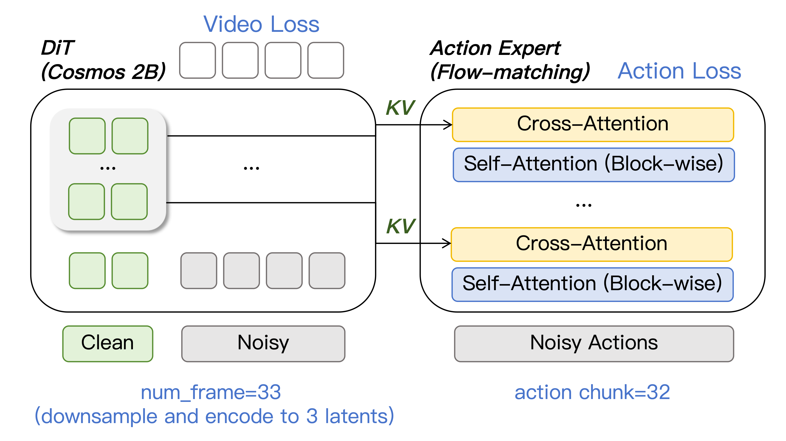

# Cosmos-WAM: 基于 Cosmos-Predict2.5 的世界动作模型

Cosmos-WAM 是一个**世界动作模型 (World Action Model)**，基于 NVIDIA Cosmos-Predict2.5-2B 构建，通过联合视频生成与动作预测进行端到端训练。模型能够同时学习“预测未来”与“控制机器人”两个任务，并在 LIBERO 与 RoboTwin 两大机器人学习 benchmark 上完成训练与评估。

---

## 架构概览

<p align="center">
  
</p>

Cosmos-WAM 的核心架构包含两部分：

1. **视频世界模型 (World Model)** — 以 Cosmos-Predict2.5-2B 的 28 层 DiT 为 backbone，通过 Rectified Flow 学习未来视频帧的生成。输入为 33 帧视频（经 VAE 编码为 3 个 latent），条件帧（通常为第 1 帧）保持干净，其余帧加入噪声进行流匹配训练。
2. **动作专家 (Action Expert)** — 一个 14 层的 ActionDiT，通过 **Cross-Attention** 逐层接收 DiT 第 14–27 层的中间 KV 特征，预测长度为 32 的动作序列（action chunk）。Action Head 使用独立的 Rectified Flow timestep，与视频分支解耦。

### 主要特性

- **基础模型**: Cosmos-Predict2.5-2B Posttrain
- **文本编码器**: Reason-1 7B（embedding 维度 100,352）
- **动作头**: 14 层 ActionDiT，带 AdaLN，逐层 cross-attention 到 DiT 第 14–27 层
- **训练方式**: 联合视频 + 动作 Rectified Flow 训练
- **数据格式**: [LeRobot](https://github.com/huggingface/lerobot) 格式（parquet + mp4）
- **分布式训练**: 基于 Accelerate + DeepSpeed ZeRO-1/2
- **评估支持**: LIBERO（单臂 7-DOF）与 RoboTwin（双臂 16-DOF）

---

## 安装

### 环境要求

- Python >= 3.10
- PyTorch >= 2.1.0
- CUDA capable GPU（推荐 80GB 显存用于训练，24GB 可用于评估）

### 安装步骤

```bash
# 1. 克隆仓库
cd /path/to/CosmosWAM

# 2. 安装 Cosmos-WAM
pip install -e .

# 3. 配置 Cosmos-Predict2.5 路径（根据你的实际路径）
export PYTHONPATH=/path/to/cosmos-predict2.5:$PYTHONPATH
```

`pyproject.toml` 已声明核心依赖，包括 `torch`, `accelerate`, `deepspeed`, `hydra-core`, `omegaconf`, `transformers`, `wandb` 等。

---

## 数据准备

### 数据集格式

训练与评估均使用 **LeRobot 格式**。一个典型的数据集目录结构如下：

```
data/
└── libero_spatial_no_noops_lerobot/
    ├── data/
    │   └── chunk-000/
    │       ├── episode_000000.parquet
    │       ├── episode_000001.parquet
    │       └── ...
    ├── meta/
    │   ├── episodes.jsonl
    │   ├── info.json
    │   ├── stats.json
    │   └── tasks.jsonl          # 任务语言描述
    └── videos/
        └── chunk-000/
            ├── observation.images.cam_high/
            │   ├── episode_000000.mp4
            │   └── ...
            └── observation.images.wrist_image/
                └── ...
```

**关键字段说明**:

- `observation.state`: 机器人本体状态（proprioception）
- `action`: 机器人动作
- `task_index`: 对应 `meta/tasks.jsonl` 中的任务索引

### 预计算文本 Embedding

Cosmos 2B Posttrain 使用 **Reason-1 7B** 文本编码器（非 T5），embedding 维度为 `[512, 100352]`。训练与评估前需预计算文本 embedding：

```bash
# LIBERO
python scripts/precompute_libero_text_embeds.py \
    --dataset_root /path/to/libero_datasets \
    --model_path /path/to/Cosmos-Reason1-7B \
    --output_dir ./data/text_embeds_cache/libero

# RoboTwin
python scripts/precompute_robotwin_text_embeds.py \
    --dataset_root /path/to/robotwin_datasets \
    --model_path /path/to/Cosmos-Reason1-7B \
    --output_dir ./data/text_embeds_cache/robotwin
```

### 数据集统计信息

训练前需计算动作归一化统计信息：

```bash
python scripts/compute_dataset_stats.py \
    --config configs/train_cosmos_2b_libero.yaml \
    --output ./dataset_stats.json
```

---

## Checkpoint 准备

### 1. 下载官方 Checkpoint

从 NVIDIA 官方发布下载 `Cosmos-Predict2.5-2B-Posttrain`，应包含：

- consolidated DiT checkpoint (约 15GB)
- `tokenizer.pth` (VAE)

### 2. 提取 DiT / VAE 权重（可选）

如果 checkpoint 是 consolidated 格式，可运行提取脚本：

```bash
python scripts/extract_ckpt.py \
    --input /path/to/81edfebe-bd6a-4039-8c1d-737df1a790bf_ema_bf16.pt \
    --output_dir ./checkpoints
```

输出：

```
checkpoints/
├── cosmos_dit.pt   # DiT 权重
└── cosmos_vae.pt   # VAE 权重
```

若已有 `tokenizer.pth`，可直接在配置中指定 `vae_checkpoint` 路径。

---

## 训练

### 配置

我们提供了针对 LIBERO 和 RoboTwin 的现成训练配置：

| 配置                                    | 说明                  |
| --------------------------------------- | --------------------- |
| `configs/train_cosmos_2b_libero.yaml`   | LIBERO 四套件联合训练 |
| `configs/train_cosmos_2b_robotwin.yaml` | RoboTwin 多任务训练   |

关键参数（以 `train_cosmos_2b_robotwin.yaml` 为例）：

```yaml
model:
    dit_checkpoint: /path/to/cosmos_dit.pt
    vae_checkpoint: /path/to/tokenizer.pth
    lambda_action: 1.0
    enable_gradient_checkpointing: true

    dit_config:
        max_img_h: 240
        max_img_w: 320
        num_blocks: 28
        model_channels: 2048
        crossattn_proj_in_channels: 100352 # Reason-1 7B

    action_head:
        action_dim: 16 # RoboTwin 双臂 16 维
        hidden_dim: 1024
        num_layers: 14

trainer:
    learning_rate: 2.0e-4
    action_learning_rate: 2.0e-4
    batch_size: 16
    mixed_precision: "bf16"
    deepspeed:
        zero_optimization:
            stage: 2
```

### 启动训练

**单节点多 GPU (Libero / RoboTwin)**:

```bash
# 使用默认 config（当前默认指向 robotwin）
python scripts/train.py

# 显式指定 LIBERO 配置
python scripts/train.py --config-name train_cosmos_2b_libero
```

**torchrun 启动**:

```bash
torchrun --nproc_per_node=4 scripts/train.py --config-name train_cosmos_2b_libero
```

**混合精度说明**: 训练支持 `bf16` / `fp16` / `no`，可在配置文件中切换。

### 训练恢复 (Resume / Hot-start)

```yaml
trainer:
    resume: true
    resume_from_checkpoint: ./outputs/.../checkpoints/step_0015000.pt
    resume_reset_step: true # true: 加载权重但 step 归零；false: 完全恢复训练状态
```

---

## 评估

### LIBERO 评估

**单任务快速测试**:

```bash
bash libero.sh
```

**批量测试全部任务**:

```bash
bash libero_batch.sh
```

**命令行自定义**:

```bash
python experiments/libero/eval_libero_single.py \
    ckpt=/path/to/checkpoint.pt \
    EVALUATION.task_suite_name=libero_spatial \
    EVALUATION.task_id=0 \
    EVALUATION.num_trials=50 \
    EVALUATION.dataset_stats_path=./dataset_stats.json \
    EVALUATION.text_embedding_cache_dir=./data/text_embeds_cache/libero
```

LIBERO 关键超参:

- `num_inference_steps`: 4–8
- `replan_steps`: 5
- `action_horizon`: 32

### RoboTwin 评估

**单任务评估**:

```bash
bash robotwin.sh
```

**带 WandB 日志的批量评估**:

```bash
bash robotwin_wandb.sh
```

**多 GPU 并行评估**（推荐用于大规模 benchmark）:

```bash
# Python 多进程版
bash robotwin_wandb_multigpu.sh

# GNU parallel 版（8 GPU 跑 4 任务并行）
bash robotwin_wandb_parallel.sh
```

RoboTwin 关键超参:

- `num_inference_steps`: 20
- `replan_steps`: 4
- `action_horizon`: 8

### 在线文本编码器（显存受限场景）

对于 24GB 显存设备（如 RTX 4090），可以在评估时开启**在线文本编码**，将 Reason-1 7B 放在独立 GPU 上实时计算 embedding：

```yaml
EVALUATION:
    use_online_text_encoder: true
    online_text_encoder_path: /path/to/Cosmos-Reason1-7B
    text_encoder_device: cuda:0
    device: cuda:1
```

---

## 项目结构

```
CosmosWAM/
├── cosmos_wam/
│   ├── models/
│   │   ├── cosmos_wam.py         # 主模型：联合视频 + 动作训练损失
│   │   ├── action_head.py        # 14 层 ActionDiT
│   │   ├── dit_wrapper.py        # MiniTrainDIT（28 层 Cosmos DiT 封装）
│   │   ├── vae_wrapper.py        # Wan2.1 VAE 接口
│   │   └── ckpt_loader.py        # Checkpoint 加载工具
│   ├── datasets/lerobot/         # LeRobot 格式数据集、Processor、Transform
│   ├── trainer.py                # 训练循环（Accelerate + DeepSpeed）
│   ├── runtime.py                # 训练入口（构建模型 + 启动训练）
│   ├── schedulers/               # Rectified Flow 相关调度
│   └── utils/                    # 日志、采样器、视频 IO 等
├── configs/
│   ├── train_cosmos_2b_libero.yaml
│   ├── train_cosmos_2b_robotwin.yaml
│   ├── sim_libero.yaml           # LIBERO 评估配置
│   └── sim_robotwin.yaml         # RoboTwin 评估配置
├── experiments/
│   ├── libero/                   # LIBERO 评估脚本
│   └── robotwin/                 # RoboTwin 评估脚本（含 WandB / 多 GPU）
├── scripts/
│   ├── train.py                  # 训练入口
│   ├── extract_ckpt.py           # Checkpoint 提取
│   ├── precompute_*_text_embeds.py # 文本 embedding 预计算
│   └── compute_dataset_stats.py  # 数据集统计信息计算
├── docs/
│   ├── va_02.png                 # 架构图
│   ├── libero_evaluation.md
│   ├── ROBOTWIN_WANDB_README.md
│   └── MULTIGPU_README.md
├── libero.sh / libero_batch.sh
├── robotwin.sh / robotwin_wandb.sh / robotwin_wandb_multigpu.sh / robotwin_wandb_parallel.sh
└── pyproject.toml
```

---

## 关键设计决策

### 为什么 Action Head 只关注 DiT 第 14–27 层？

- 第 0–13 层主要编码底层视觉特征（边缘、纹理、颜色）
- 第 14–27 层编码高层语义与时空特征（物体、运动、affordance）
- 机器人动作决策需要语义理解而非底层像素，因此 cross-attention 仅接入后半部分层级

### 视频与动作使用独立的 Timestep

- 视频分支和动作分支在训练期间可处于不同的噪声水平
- 相比共享 timestep 更加灵活
- 与 FastWAM 等 SOTA 设计保持一致

---

## 故障排除

### 显存不足 (OOM)

1. 减小 `batch_size`（尝试 1）
2. 确保 `enable_gradient_checkpointing: true`
3. 切换到 DeepSpeed ZeRO-3
4. 降低 `video_size` 或 `num_frames`
5. 评估时开启 `use_online_text_encoder` 分流文本编码器

### 文本 Embedding 维度不匹配

若出现 `crossattn_proj` 维度错误，请检查：

- 是否使用了 **Reason-1 7B**（100,352 维）而非 T5（1,024 维）
- 配置中 `use_crossattn_projection=true` 且 `crossattn_proj_in_channels=100352`

### 动作损失不收敛

1. 检查动作是否已归一化到合适范围
2. 增大 `action_learning_rate`（尝试 2e-4）
3. 验证文本 embedding 是否正确加载且与训练时一致
4. 检查 `dataset_stats.json` 是否与训练配置匹配

---

## 许可证

Apache 2.0（遵循 Cosmos 许可证条款）
